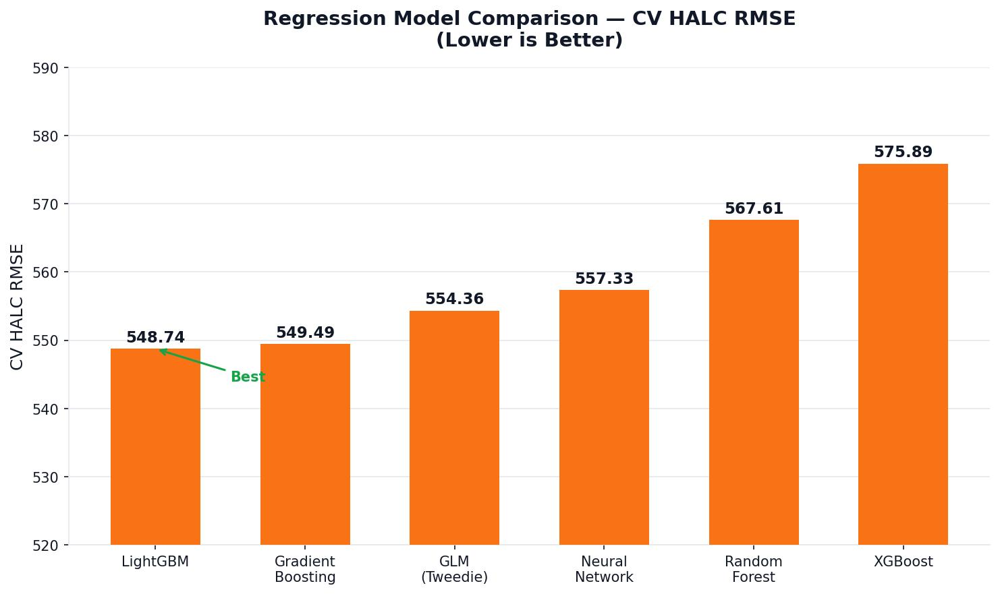
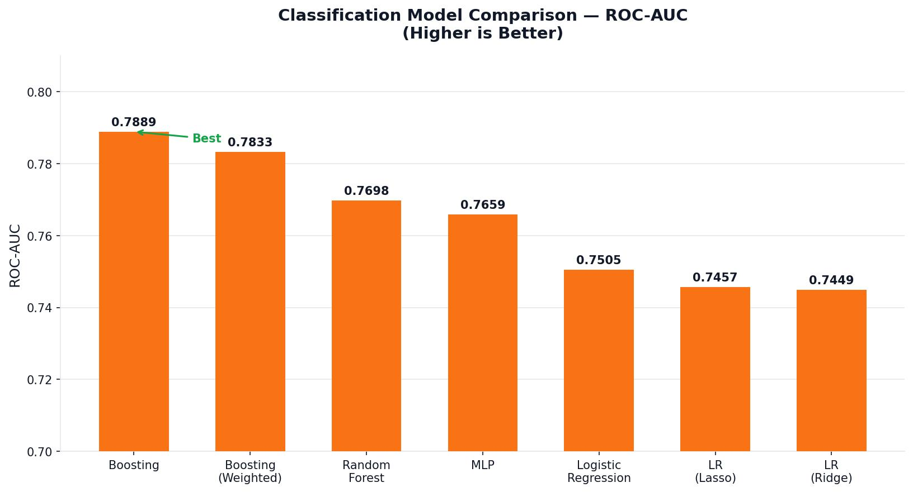
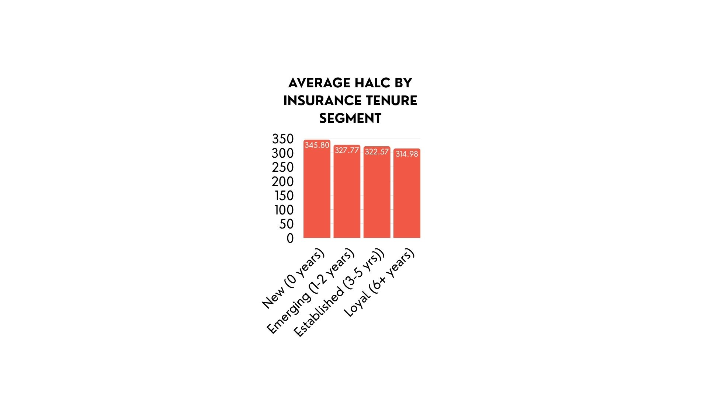
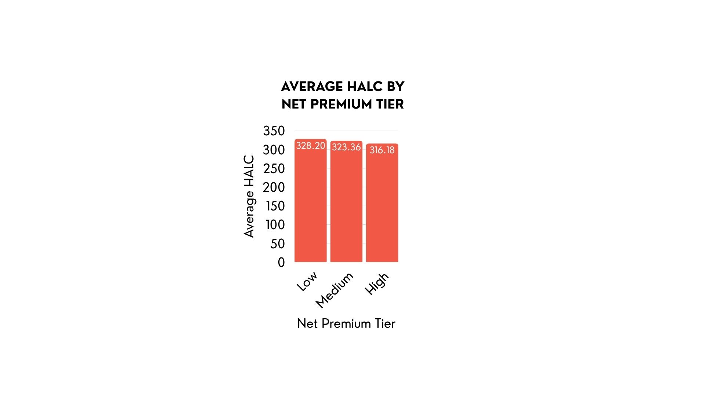

# Which Policyholders Will Cost the Most?
**Predictive Modeling · Insurance Analytics · LightGBM · SHAP**

---

## Overview
Insurance companies price policies at onboarding without a reliable way to predict which customers will generate the highest claims. This project built and compared models to predict claim likelihood and expected loss cost for new policyholders — translating outputs into pricing, underwriting, and retention strategy.

> Full write-up: https://jasminebahremand.my.canva.site/

---

## Key Findings
- **LightGBM achieved the lowest RMSE (548.74)** on loss cost prediction — strongest across all regression models tested
- **Gradient Boosting achieved ROC-AUC=0.7889** on claim classification — highest across seven models
- **Sample weighting nearly tripled recall for actual claims** (0.06 → 0.18) with only marginal ROC-AUC reduction — a meaningfully better model for real-world use
- **Emerging policyholders (3–5 years) carried the highest average loss cost ($713)** — nearly double that of Loyal customers (11+ years, $386) — risk does not grow linearly with tenure

---

## Key Visuals

### Model Performance Comparison (RMSE)

LightGBM achieved the lowest CV RMSE (548.74) across all regression models tested — outperforming Gradient Boosting, GLM, Neural Network, Random Forest, and XGBoost.

### Classification Model Performance (ROC-AUC)

Gradient Boosting achieved the highest ROC-AUC (0.7889) across all seven classification models — correctly identifying high-risk policyholders 79% of the time.

### Loss Cost by Customer Tenure

Emerging policyholders (3–5 years) carry the highest average loss cost and greatest volatility. Loyal customers (11+ years) show the lowest and most predictable risk.

| Segment | Mean Loss Cost |
|---------|---------------|
| New (0–2 yrs) | $598 |
| Emerging (3–5 yrs) | $713 |
| Established (6–10 yrs) | $664 |
| Loyal (11+ yrs) | $386 |

### Loss Cost by Premium Tier

Low-premium customers show the highest variability in claims costs — indicating systematic underpricing at the low end of the portfolio.

---

## Methods
- Feature engineering from raw date fields (age, vehicle age, driving experience, policy duration)
- Regression: GLM (Tweedie), Random Forest, Gradient Boosting, XGBoost, LightGBM, Neural Network
- Classification: Gradient Boosting, Random Forest, Logistic Regression (Lasso/Ridge), MLP
- 5-fold cross-validation and hyperparameter tuning via grid search
- SHAP for model interpretation and feature importance
- Customer segmentation by insurance tenure and premium tier

---

## Tech Stack
Python · Pandas · Scikit-learn · XGBoost · LightGBM · SHAP · Statsmodels · Matplotlib

---

## How to Run
```bash
pip install -r requirements.txt
jupyter notebook insurance_risk_modeling.ipynb
```

---

## Data
Dataset provided as part of USC Marshall coursework and is not publicly available.

Key features include policy dates, vehicle registration year, net premium, insurance tenure, and demographic fields. Engineered features: age, vehicle age, driving experience, policy duration, and time since last renewal.

---

## Files
- `insurance_risk_modeling.ipynb` — full modeling notebook
- `requirements.txt` — dependencies
- `plots/` — generated visualizations
