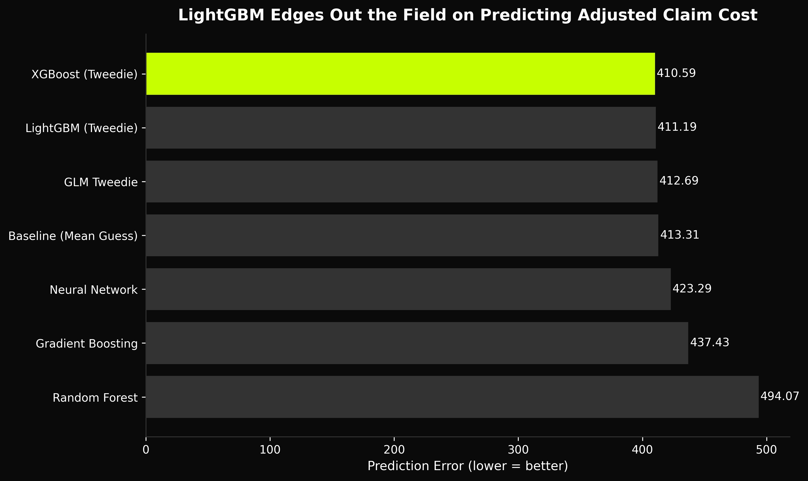
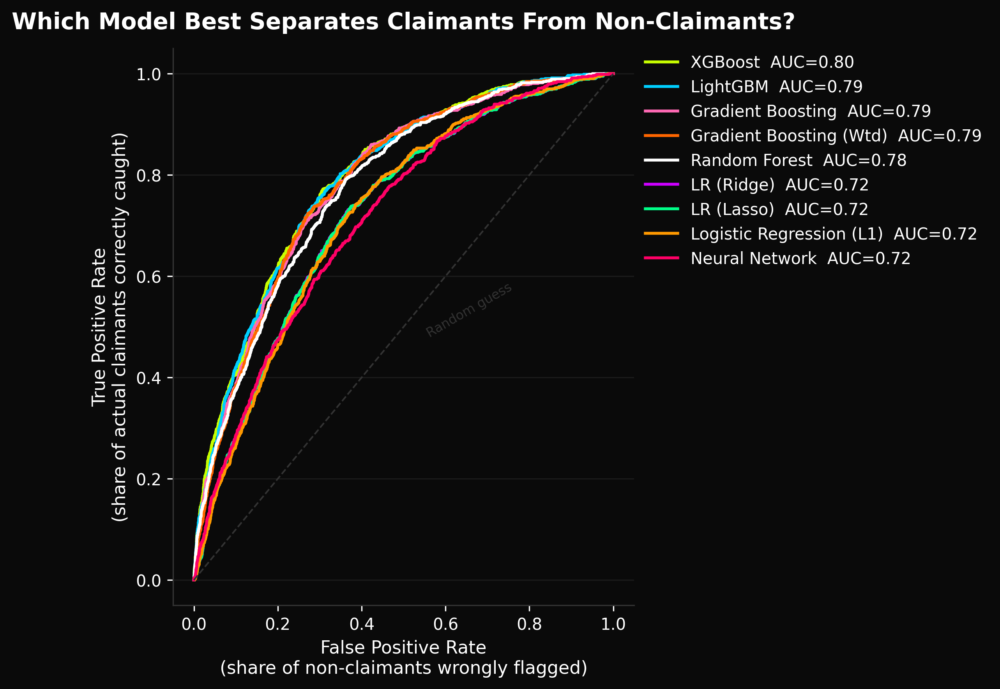
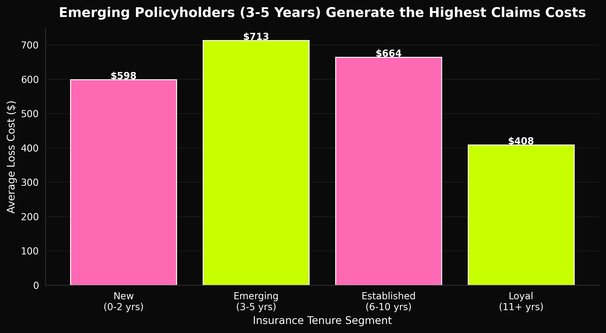
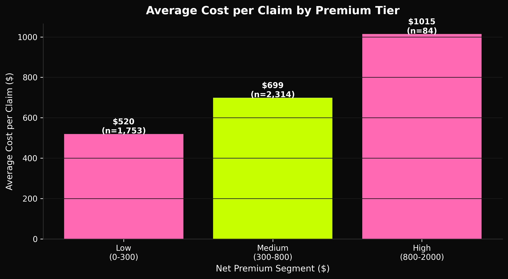

# Which Policyholders Will Cost the Most?
XGBoost · LightGBM · SHAP · 37,451 Policyholders

## Overview
Insurance companies price policies at onboarding without a reliable way to predict which customers will generate the highest claims. This project built and compared models to predict claim likelihood and expected loss cost for new policyholders — translating outputs into pricing, underwriting, and retention strategy.

Full write-up: https://jasminebahremand.my.canva.site/

## Key Findings
- XGBoost achieved the lowest HALC RMSE (410.59) on loss cost prediction, narrowly ahead of LightGBM (411.19) — both far ahead of a traditional GLM Tweedie model and a simple baseline.
- A frequency × severity two-stage model (predicting claim likelihood and claim cost separately, then combining them) landed within a hair of the single best model (RMSE 410.07 vs. 410.68) — confirming the ~410 error region is a real ceiling in the data, not a modeling artifact.
- XGBoost achieved ROC-AUC of 0.80 on claim classification, and at an optimized threshold (0.15) correctly identifies 64.5% of policyholders who go on to file a claim, versus just 5% at a default 0.50 cutoff.
- Emerging policyholders (3–5 years tenure) carry the highest average loss cost ($713) — nearly double that of Loyal customers (11+ years, $408) — risk does not grow linearly with tenure.
- Average cost per claim rises steadily with premium tier, from $520 (Low) to $1,015 (High), suggesting premium tier is already a meaningful, if imperfect, risk signal.

Bottom line: claim cost is genuinely hard to predict from onboarding features alone, but claim likelihood is predictable enough to meaningfully inform underwriting and pricing decisions.

## Key Visuals

### Model Performance Comparison (RMSE)

XGBoost achieved the lowest HALC RMSE (410.59) across all regression models tested — narrowly ahead of LightGBM and well ahead of Gradient Boosting, GLM, Neural Network, and Random Forest.

### Classification Model Performance (ROC-AUC)

XGBoost achieved the highest ROC-AUC (0.7955) across all classification models — correctly ranking a random claimant above a random non-claimant about 80% of the time.

### Loss Cost by Customer Tenure

Emerging policyholders (3–5 years) carry the highest average loss cost. Loyal customers (11+ years) show the lowest and most predictable risk.

| Segment | Mean Loss Cost |
|---------|---------------|
| New (0–2 yrs) | $598 |
| Emerging (3–5 yrs) | $713 |
| Established (6–10 yrs) | $664 |
| Loyal (11+ yrs) | $408 |

### Loss Cost by Premium Tier

Average cost per claim rises steadily with premium tier — from $520 at the low end to $1,015 for high-premium policyholders — suggesting premium tier is already a meaningful, if imperfect, risk signal.

## Methods
- Feature engineering from raw date fields (age, vehicle age, driving experience, policy duration, time since last renewal)
- Regression: GLM (Tweedie), Random Forest, Gradient Boosting, XGBoost (Tweedie), LightGBM (Tweedie), Neural Network — plus a frequency × severity two-stage robustness check
- Classification: XGBoost, LightGBM, Gradient Boosting (standard and class-weighted), Random Forest, Neural Network, Logistic Regression (L1/Lasso/Ridge)
- Hyperparameter tuning via grid search on the top regression models
- Threshold sweep to optimize the classification cutoff for F1, rather than defaulting to 0.50
- SHAP for model interpretation and feature importance on both the cost and classification models
- Customer segmentation by insurance tenure and premium tier

## Limitations
The cost model's accuracy gain over a naive baseline is real but modest — claim severity has a large amount of inherent randomness that policyholder-level features alone can't explain. HALC is undefined for first-time claimants with no prior claim history, so those rows were excluded from cost modeling. All features are static, policyholder-level attributes at a single point in time — there's no information about the specific circumstances of an accident, weather, or driving behavior over time. This is training/validation data from a single academic dataset, not a live production feed, so some accuracy drift would be expected on real, evolving data.

## Next Steps
Combine the frequency and severity models into one true expected-cost pipeline (P(claim) × expected cost if claimed) and compare it against the single Tweedie model on a wider set of metrics. Test whether richer features — accident-specific detail, driving behavior over time, or external risk data — meaningfully close the gap on the cost side. Validate the classification threshold (0.15) across different time periods rather than a single static split, to check it holds up as claim patterns shift.

## Tech Stack
Python · Pandas · Scikit-learn · XGBoost · LightGBM · SHAP · Matplotlib

## How to Run
```bash
git clone https://github.com/jasminebahremand/insurance-risk-modeling.git
cd insurance-risk-modeling
pip install -r requirements.txt
jupyter notebook insurance_risk_modeling.ipynb
```
`insurance_train.csv` is included in this repo — no manual upload needed. Opening the notebook in Colab also works; it will pull the CSV straight from GitHub if it's not found locally.

## Data
Dataset (`insurance_train.csv`) is included in this repo. It was originally provided as part of USC Marshall coursework. Key features include policy dates, vehicle registration year, net premium, insurance tenure, and demographic fields. Engineered features: age, vehicle age, driving experience, policy duration, and time since last renewal.

## Files
- `insurance_risk_modeling.ipynb` — full modeling notebook
- `requirements.txt` — dependencies
- `insurance_train.csv` — dataset
- `plots/` — generated visualizations
